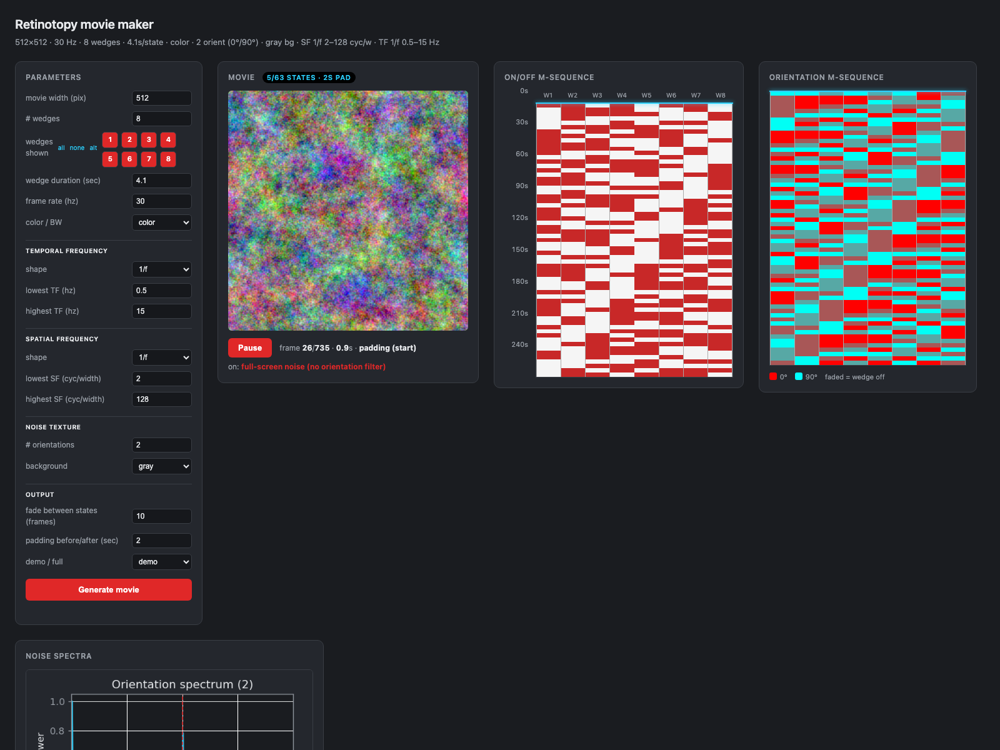

# Multifocal m-sequence retinotopy noise stimulus

A generator and web UI for building **spatiotemporal noise movies** for
retinotopic mapping and voxelwise encoding-model experiments. The stimulus is a
disc split into **regions** — either angular **wedges** (pie slices, for
polar-angle mapping) or concentric **rings** (for eccentricity mapping). Each
region is independently turned on/off by an m-sequence and filled with bandpass
**1/f noise** of a specific **orientation** (set by a second m-sequence). Movies
are written as a sequence of PNG frames.

> **Browser guides** (with the server running): a plain-language
> [Beginner's guide](docs.html) (`http://localhost:8000/docs.html`) that assumes no
> vision-science background, and a [User's guide](users-guide.html)
> (`http://localhost:8000/users-guide.html`) — the operating manual and technical
> reference. This README mirrors the User's guide in Markdown form.



---

## Quick start

Requirements: Python 3 with `numpy`, `Pillow`, `matplotlib` (no other deps).

```bash
python3 server.py          # starts a local server (stdlib only)
# open http://localhost:8000  in a browser
```

Set parameters in the left panel, click **Generate movie**, and the viewer shows
the result (movie, design matrices, spectra). **Cancel** stops a long run.

> The page must be opened through the server (`http://localhost:8000`), **not**
> as a `file://` — generation needs the backend. Opening the file directly shows
> a message telling you this.

The movie is written to `frames/frame_00000.png …`. Metadata and plots are
written alongside (see [Outputs](#outputs)).

---

## What the stimulus is

- The display is a disc (diameter = movie width) split into **N regions** —
  **wedges** (equal angular sectors) or **rings** (concentric annuli). Everything
  below is identical for both; only the region shape differs.
- An **on/off m-sequence** turns each region on or off in each *state* (multifocal
  design): each region follows a distinct circular shift of one binary
  maximum-length sequence, so the region regressors are near-orthogonal.
- Each *on* region is filled with **multicolored bandpass 1/f noise**, confined to
  a single **orientation** chosen by a **second, independent m-sequence**.
- The noise is **independent per region** (its own random seed), so neighboring
  regions show a discontinuity at their shared boundary.
- Each state lasts `wedge_sec` seconds and **fades** in/out to the background.
- The movie is optionally **padded** before and after with full-screen isotropic
  noise.

A *state* = one configuration of (which regions are on) × (each on-region's
orientation). There are **63 states** (a length-2⁶−1 m-sequence). "Demo" renders
the first 5 states; "full" renders all 63.

> The parameter keys keep their historical `wedge_*` / `n_wedges` names even in
> rings mode (a "region" is a wedge or a ring); the UI relabels them for you.

---

## Files

| File | Role |
|------|------|
| `generator.py` | The parameterized generator: `generate_movie(params, progress_cb, cancel_cb)`. Builds the m-sequences, renders frames, spectra, matrices, and `movie_meta.json`. |
| `server.py` | Local HTTP server (stdlib). Serves the UI and assets; `POST /generate`, `GET /status`, `POST /cancel`. |
| `index.html` | Web UI (parameter form + Generate/Cancel) and the viewer (movie player, on/off & orientation matrices, spectra). Reads `movie_meta.json`. |
| `INTERFACE.txt` | The *original* parameter sketch (name, units, default). Historical reference only — it predates several options (geometry/rings, `oriented`/`oriented_mseq` backgrounds, fixation, …); the live defaults are `DEFAULTS` in `generator.py` and the form fields in `index.html`. |
| `make_movie.py`, `make_msequence_movie.py`, `make_noise_movie.py`, `generate_design_matrix.py` | **Legacy / incremental** development scripts (rotating wedge → m-sequence → noise → orientation → …). Superseded by `generator.py`; kept for reference. |

---

## Parameters

Defaults below mirror `DEFAULTS` in `generator.py` (and the `index.html` form). All are exposed in the UI.

| Parameter | Units | Default | Notes |
|-----------|-------|---------|-------|
| stimulus | wedges \| rings | wedges | Geometry of the disc regions: `wedges` = equal angular sectors (polar-angle mapping); `rings` = concentric annuli (eccentricity mapping). Everything else — the m-sequences, orientation, noise, fades, subset, background, fixation — is identical for both. The region count, subset toggles, and per-state durations relabel from "wedge…" to "ring…". |
| movie width | pixels | 512 | Frame is `width × width`. |
| # wedges / # rings | – | 8 | Number of regions: equal angular wedges, or concentric rings. |
| wedges / rings shown | – | all on | Per-region include/exclude toggles (with all/none/alternate presets). Excluded regions are always off; the geometry and m-sequence are unchanged. |
| wedge rotation | degrees | 22.5 | (wedges only) Offsets all wedge boundaries counter-clockwise (`360/(2·N)` = 22.5° for 8 wedges puts the divisions halfway between the un-rotated ones, i.e. off the cardinal axes). Hidden in rings mode. |
| ring spacing | log \| equal_width \| equal_area | log | (rings only) How eccentricity is sampled across the rings. `log` = thin near the fovea, thick in the periphery (≈ equal cortical area, the retinotopy standard); `equal_width` = equal radial thickness; `equal_area` = equal screen area per ring. Hidden in wedges mode. |
| wedge / ring duration | sec | 4.1 | Length of each state → `frames_per_state = round(fps·dur)`. |
| frame rate | Hz | 30 | Render/display rate. |
| color / BW | – | color | `color` = 3 independent RGB channels; `bw` = grayscale. |
| TF shape | 1/f \| flat | 1/f | Temporal amplitude spectrum. |
| lowest / highest TF | Hz | 0.5 / 15 | Temporal passband. |
| SF shape | 1/f \| flat | 1/f | Spatial amplitude spectrum. |
| lowest / highest SF | cyc/width | 2 / 128 | Spatial passband in cycles across the movie width. Changing **movie width** auto-rescales these by the width ratio to keep the same cycle proportions (constant cycles-per-pixel), which also keeps the band within the Nyquist. |
| # orientations | – | 2 | Equally spaced image orientations `i·180/K`. |
| background | gray \| random \| oriented \| oriented_mseq | gray | `random` = isotropic noise behind the wedges; `oriented` = single-orientation noise whose angle is, each state, as orthogonal as possible to that state's wedge orientations; `oriented_mseq` = single-orientation noise whose angle is set, each state, by a **third m-sequence** (interleaved `90/K°` from the foreground angles; K=2 → 45°/135°). See the UI reference for both oriented modes. |
| fade frames | frames | 5 | Per-state fade in/out. |
| padding | sec | 2 | Full-screen isotropic noise before & after the movie. |
| fixation spot | off \| on | on | A 2×2-px square at the display center that switches to a random color every 0.5 s (baked into every frame; color sequence recorded in metadata). |
| random seed | integer ≥ 0 | 1234 | Base RNG seed. The **same seed + same parameters → an identical movie**; change it to draw a different noise realization with the *same* statistics. Negative values are coerced to their absolute value; non-numeric falls back to 1234. Recorded in metadata. |
| demo / full | – | demo | `demo` = first 5 states, `full` = all 63. |

"1/f" means **amplitude ∝ 1/f** (power ∝ 1/f²).

---

## UI reference (every control)

### Parameters panel

- **stimulus** — `wedges` divides the disc into equal **angular sectors** (the
  classic polar-angle mapping); `rings` divides it into **concentric annuli** (the
  eccentricity mapping). The choice only changes the region *geometry* — the on/off
  and orientation m-sequences, the per-region independent oriented noise, fades,
  subset toggles, background, fixation, and spectra are all identical. The region
  controls relabel accordingly (`# wedges` → `# rings`, etc.); `wedge rotation`
  shows only for wedges, `ring spacing` only for rings. Default wedges.

- **movie width (pix)** — side length of the square frame (`width × width`). Sets
  the spatial resolution and the spatial Nyquist (`width/2` cyc/width). Changing it
  auto-rescales the SF band (below) to preserve the cycle proportions. Larger widths
  mean sharper noise but slower generation and larger files. Default 512.

- **\# wedges / \# rings** — number of regions the disc is divided into: equal
  angular sectors (wedges) or concentric annuli (rings). Each region becomes one
  on/off regressor (with m-sequence shift `round(k·63/N)`). Changing this rebuilds
  the "shown" toggles (all on). Ring 1 is the innermost (foveal) annulus. Capped at
  the m-sequence length **63** (more regions can't get distinct shifts). Default 8.

- **wedges / rings shown** — one toggle chip per region (red = shown, dark =
  hidden), with **all / none / alt** preset links (`alt` = every other region).
  Hidden regions are forced always-off and never display noise; the disc geometry
  and m-sequence are unchanged. Use this to present, say, only every other ring.

- **wedge rotation (deg)** — *(wedges only)* rotates all wedge boundaries
  counter-clockwise by this many degrees. Purely geometric — it moves where the
  divisions fall without touching the m-sequence, noise, or orientations. e.g.
  `22.5` (= 360/(2·8)) puts the divisions halfway between the un-rotated ones, so
  no boundary lands on the cardinal axes. Hidden in rings mode. Default 22.5.

- **ring spacing** — *(rings only)* how the ring boundaries are spread across
  eccentricity, from fovea (radius 0) to the disc edge:
  - `log` — equally spaced in `log(r + r0)` with a small foveal offset
    (`r0 = 0.05·radius`): rings are thin near the fovea and thick in the periphery,
    so each subtends roughly equal cortical area. The retinotopy standard. Default.
  - `equal_width` — every annulus has the same radial thickness (`r_k = radius·k/N`);
    uniform on screen but over-samples the periphery relative to cortex.
  - `equal_area` — every annulus has the same screen area (`r_k = radius·√(k/N)`);
    rings get thinner outward, uniform pixel count per region.

- **wedge / ring duration (sec)** — how long each of the 63 states is shown. Sets
  `frames_per_state = round(fps · duration)` and the **lowest temporal frequency**
  the noise can contain within a state (`1/duration`, ≈ 0.24 Hz at 4.1 s). Default 4.1.

- **frame rate (hz)** — render/display rate. Caps the temporal band at the Nyquist
  `fps/2` (15 Hz at 30 Hz). Default 30.

- **color / BW** — `color` draws three independent noise fields (one per RGB
  channel) through the same filter, so each Fourier component gets a random colour;
  `bw` uses one grayscale field. Default color.

- **temporal frequency → shape** — `1/f` (amplitude ∝ 1/f) or `flat` (equal
  amplitude in band) temporal spectrum. Default 1/f.
- **lowest / highest TF (hz)** — temporal passband edges. Keep `highest ≤ fps/2`
  (no aliasing) and `lowest ≥ 1/wedge_sec` (representable in a state). Defaults 0.5 / 15.

- **spatial frequency → shape** — `1/f` or `flat` spatial (radial) spectrum. Default 1/f.
- **lowest / highest SF (cyc/width)** — spatial passband in cycles across the movie
  width. Keep within `[~1, width/2]` (the spatial Nyquist). **Auto-scaling:** when
  you change the **movie width**, both SF values are multiplied by the width ratio
  so the texture keeps the same cycle proportions (constant cycles-per-pixel) and
  the band stays in range — e.g. halving the width from 512 to 256 turns 2 / 128
  into 1 / 64. Edit the SF values *after* setting the width if you want a different
  band. Defaults 2 / 128.

- **\# orientations** — number `K` of equally spaced image orientations (`i·180/K`)
  the wedge/background textures can take. `K=2` → {0°, 90°}; `K=4` → add 45°/135°.
  Each on-wedge's orientation is chosen by the orientation m-sequence. **Note:**
  every orientation (cardinal and oblique alike) uses the *same* thin Fourier
  wedge, so all orientations have matched spatial bandwidth (see caveats). Default 2.

- **background** — what fills the disc behind/around the wedges:
  - `gray` — flat mid-gray.
  - `random` — full-frame **isotropic** 1/f noise (all orientations).
  - `oriented` — full-frame **single-orientation** 1/f noise whose angle is chosen,
    *each state*, to be as orthogonal as possible to that state's on-wedge
    orientations (the midpoint of the largest empty arc on the orientation circle;
    exactly perpendicular when the wedges share one orientation, 45° when both 0°
    and 90° are present). The angle changes from state to state and is recorded for
    all 63 states in `bg_orient` (see Outputs).
  - `oriented_mseq` — full-frame **single-orientation** 1/f noise whose angle is set,
    *each state*, by a **third m-sequence** (distinct primitive polynomial
    `x⁶+x⁵+x²+x+1`), decoded `mod K` like the foreground. Its `K` angles are the
    foreground set rotated half a step (`90/K°`), so background and foreground
    orientations **interleave** instead of coinciding (K=2: foreground 0°/90° →
    background 45°/135°; K=1: 0° → 90°). Per-state angles are recorded in
    `bg_orient`, the angle set in `bg_angles`.
  - Default gray.

- **fade between states (frames)** — length of the per-state contrast ramp. Each
  state fades its wedges in from / out to the background over this many frames (so a
  gray background returns to gray between states; an oriented background stays).
  Default 5.

- **padding before/after (sec)** — seconds of full-screen **isotropic** 1/f noise
  prepended and appended to the movie (e.g. for fMRI run lead-in/out). Default 2.

- **fixation spot** — `on` overlays a **2×2-pixel square at the exact center** of
  every frame (padding included) that switches to a new **random color every
  0.5 s**. Drawn on top at full contrast as a fixation target; the seeded
  per-block color sequence is saved to `fixation_colors` in the metadata. Default on.

- **demo / full** — `demo` renders only the first 5 states (quick iteration);
  `full` renders all 63. Default demo.

### Buttons

- **Generate movie** — POSTs the current parameters to the server, which renders in
  the background; the progress bar tracks frames and the viewer reloads when done.
- **Cancel** — appears while generating; aborts the run within ~one wedge's compute.
  A cancelled run leaves `frames/` partial (just regenerate).

### Viewer

- **Movie** — canvas player (Pause/Play), looping the rendered frames at the true
  frame rate. The pill shows `states / preview / pad`; the readout shows the current
  frame, time, state (or "padding"), and the on-wedges with their orientations.
- **On/off m-sequence** — the design matrix (states top→bottom × regions W1…WN for
  wedges, R1…RN for rings; red = on). A cyan cursor and a time axis track playback;
  active region columns highlight.
- **Orientation m-sequence** — orientation index per state×wedge, one hue per
  orientation (legend lists the angles), off-wedges dimmed.
- **Noise spectra** — measured orientation, spatial (radial + 2-D), and temporal
  spectra of the generated noise vs. the ideal, for verification. Sampled from
  state 0, so they show the orientations present in that state.

---

## Important stimulus-generation issues

These are real constraints of the method — read before designing an experiment.

### 1. Temporal frequency is limited by the frame rate (Nyquist)
The highest representable temporal frequency is **`fps/2`**. At 30 Hz that is
**15 Hz**. Requesting a higher `highest TF` will alias and the realized spectrum
will not match the request. The UI does **not** clamp this — keep
`highest TF ≤ fps/2`.

### 2. The lowest temporal frequency is set by the state duration
Each state is an **independent** noise block of length `frames_per_state`. The
lowest temporal frequency it can contain is **`1 / wedge_sec`** (= `fps /
frames_per_state`). For a 4.1 s state that is ≈ **0.244 Hz**. A `lowest TF`
below this can't be represented within a state (the default 0.5 Hz is safe).
There is no temporal continuity *across* states.

### 3. Orientation filtering and the discrete FFT grid
Orientation is imposed by keeping only the Fourier components within a **thin
angular wedge** through the origin (half-width `min(4°, 90/2K°)`). **All**
orientations — cardinals (0°/90°) and obliques (45°/135°) alike — use the *same*
finite wedge.

A cardinal could instead be kept as an *exact* axis line (`fx=0` / `fy=0`), since
it lands on the integer FFT grid, whereas an oblique cannot. But an exact line
makes the field effectively **1-D and perfectly coherent along the bar**, while a
wedge produces a **2-D texture** — so cardinal and oblique stimuli would differ
in *coherence*, not just orientation. That is a confound for a figure/ground
orientation contrast (a region could be distinguished by its coherence rather
than its orientation). Using one finite wedge for every orientation matches their
spatial bandwidth, so only orientation varies.

### 4. "# orientations" does not change the m-sequence — it changes bit decoding
There is **one** binary orientation m-sequence (length 63). For `K` orientations,
each wedge reads a window of **`ceil(log2 K)` bits** of that sequence (at its own
shift) and takes the value `mod K`:

- `K = 2` → read 1 bit → {0°, 90°}.
- `K = 4` → read 2 bits → {0°, 45°, 90°, 135°}.

This is a pragmatic decoder, **not** a true K-ary (GF(K)) maximum-length
sequence, so the ideal balance/decorrelation guarantees do **not** hold exactly
for `K > 2`. Measured balance over all 63×8 assignments:

| K | counts per orientation | ideal even |
|---|------------------------|-----------|
| 2 | 248 / 256              | 252 |
| 4 | 120 / 128 / 128 / 128  | 126 |

Powers of two (2, 4, 8) stay close to balanced; non-powers (e.g. 3) are more
biased because `mod K` folds the bit values unevenly. A proper K-ary m-sequence
and grid-aligned off-axis orientations are possible but not yet implemented.

### 5. Decorrelated m-sequences (location, orientation, background)
The design uses up to **three** order-6 m-sequences, each from a distinct
primitive polynomial, all of length 63:

- **on/off** (region location): `x⁶+x+1` (taps `[6,1]`).
- **orientation** (per-region foreground orientation): `x⁶+x⁴+x³+x+1` (taps `[6,4,3,1]`).
- **background** (whole-field background orientation, *only* when `background =
  oriented_mseq`): `x⁶+x⁵+x²+x+1` (taps `[6,5,2,1]`).

Every region reads the on/off and orientation sequences at the *same* circular
shift, so for every region their correlation is just the zero-shift correlation of
the two base sequences (**≈ −0.02**); **wedge location and orientation are
therefore separately estimable** in an encoding model. The background, by
contrast, is a *single* stream read at one fixed shift (not per region), so its
correlation with a given region's regressor depends on that region's shift and is
**not** uniformly ≈ −0.02: at the defaults (N=8, K=2) it is ≈ −0.02 for most
regions but ≈ 0.24 for one, and the worst case over all shifts is ≈ 0.27 (vs
on/off) / ≈ 0.37 (vs orientation). These are modest — the background-orientation
regressor stays separable from the foreground — but distinct primitive polynomials
alone do *not* guarantee the tight decorrelation the same-shift foreground pair
enjoys (that would require a preferred/Gold pair).

The background stream is decoded `mod K` from `ceil(log₂K)` consecutive bits
(exact only for K=2 — the same K-ary decoder, and the same bias, as the
foreground). Its K angles are the foreground set `i·180/K` rotated by half a step
(`90/K°`), so foreground and background orientations **interleave** rather than
coincide (K=2: foreground 0°/90° → background 45°/135°; K=1: 0° → 90°). Because it
is driven by its own schedule rather than recomputed from the on-regions, it
cycles through all K background orientations regardless of region count — counts
over 63 states are near-balanced for powers of two (K=2 → 31/32; K=4 →
15/16/16/16) and more uneven otherwise (K=3 → 31/16/16). Contrast the `oriented`
background in §9, whose distinct-angle count *shrinks* as regions grow.

### 6. Spatial frequency units and limits
`cyc/width` = cycles per movie width, which equals the integer FFT index when the
field is `width` pixels. The spatial Nyquist is **`width/2`** cyc/width (256 for a
512-px movie). Keep the SF passband within `[~1, width/2]`. Because the unit is tied
to the pixel width, the UI **auto-rescales** the SF band whenever you change the
movie width (multiplying by the width ratio) so the cycle proportions — and the
in-range guarantee — are preserved; the generator itself takes the SF band as given.

### 7. Independent per-wedge noise → boundary discontinuities
Each wedge gets its own seed, so adjacent wedges (even of the same orientation)
are independent and show a visible seam at the boundary. This is intentional.

### 7a. Wedge subsets
"Wedges shown" masks the design: excluded wedges are forced always-off
(`design[:, k] = 0`) and never display noise, while the disc geometry and the
m-sequence shifts of the remaining wedges are unchanged. So "every other wedge"
keeps the 8-wedge layout but only fills wedges 1, 3, 5, 7. The excluded columns
appear empty in the on/off matrix and dimmed in the orientation matrix.

"Wedge rotation" is purely geometric: it offsets where the wedge boundaries fall
(`angle - rotation`) without touching the m-sequence, noise, or orientations.

### 8. Color vs. BW
`color` draws **three independent noise fields** through the same filter, so every
Fourier component carries an independent random RGB (randomly multicolored) while
each channel keeps the exact target spectrum. `bw` uses a single grayscale field.

### 9. Background and padding noise
`random` background and the start/end padding are **isotropic** 1/f noise (all
orientations present), i.e. the same parameters but **without** orientation
filtering. The `oriented` background is single-orientation noise whose angle is
chosen *per state* to be maximally orthogonal to that state's wedge orientations;
when a state mixes orientations the background takes the best-compromise angle
(e.g. 45° for {0°, 90°}), which may itself be off-axis (a thin Fourier wedge). The
per-state background orientations are saved in `bg_orient` for the full design.

**How many distinct background orientations will an experiment contain (with the
`oriented` background)?** The background angle depends only on *which subset* of
the `K` region orientations is present in a state (not on how many regions show
it), passed through the largest-empty-arc rule. Every output therefore lands on a
`90/K`° grid, so there are at most **2K** possible values — but far fewer actually
occur. Counting the distinct `bg_orient` values across all 63 states:

| # wedges/rings | # region orientations (K) | # background orientations | background values (deg) |
|---:|---:|---:|---|
| 4  | 1 | 2 | 0, 90 |
| 8  | 1 | 1 | 90 |
| 4  | **2** | **3** | 0, 45, 90 |
| **8**  | **2** | **3** | **0, 45, 90** |
| 12 | 2 | 2 | 0, 45 |
| 16 | 2 | 1 | 45 |
| 4  | 3 | 6 | 0, 30, 60, 90, 120, 150 |
| 8  | 3 | 5 | 0, 30, 60, 90, 120 |
| 16 | 3 | 3 | 0, 30, 60 |
| 4  | 4 | 8 | 0, 22.5, 45, 67.5, 90, 112.5, 135, 157.5 |
| 8  | 4 | 8 | 0, 22.5, 45, 67.5, 90, 112.5, 135, 157.5 |
| 16 | 4 | 4 | 22.5, 45, 135, 157.5 |
| 8  | 6 | 8 | 30, 60, 75, 90, 105, 120, 135, 165 |

With the defaults (**8 regions, K=2**) there are **3** background orientations:
**0°, 45°, 90°**. Two non-obvious points:

- For `K=2` the `2K` ceiling is 4 (0/45/90/135°) but only 3 ever occur: when both
  0° and 90° are present the two empty arcs tie and the rule always takes the
  *first* (→ 45°, never 135°).
- **More regions → *fewer* background orientations.** With more on-regions per
  state it becomes very likely that *all* `K` orientations are present at once, and
  the full set always maps to the single symmetric angle `90/K`°. So large `N`
  drives the background toward one constant value (`K=2` → just 45°); use smaller
  `N` or larger `K` if you want the background orientation to *vary* over the run.

This whole table and its region-count dependence apply **only to the `oriented`
background**. The **`oriented_mseq`** background sidesteps it entirely: its third
m-sequence cycles through exactly **`K`** background orientations — the interleaved
angles recorded in `bg_angles` (K=2 → 45°/135°; K=4 → 22.5/67.5/112.5/157.5°) —
**regardless of region count**, with near-balanced occurrence for powers of two
(K=2 → 31/32 over the 63 states; K=4 → 15/16/16/16) and the same `mod K` bias as
the foreground otherwise. So if you want a background that varies evenly over the
run independent of `N`, use `oriented_mseq` rather than `oriented`.

### 10. Fades are to background, not crossfades
Each state fades its contrast in from / out to the background over `fade frames`.
States do **not** overlap (no crossfade), so between states the screen returns to
the background (gray, or the background noise).

### 11. Contrast clipping
Noise is mapped `128 + 38·z` and clipped to `[0,255]` (≈0.05% of pixels clip for
the default 1/f settings). Flat spectra or very wide bands concentrate more
energy and can clip more, slightly distorting the realized spectrum. Lower the
gain in `generator.py` (`GAIN`) if clipping matters for your stimulus.

### 12. Frame layout, scale, and cancellation
- Layout: `[pad] [state 0] … [state n] [pad]`. `movie_meta.json` records
  `pad_frames`, `frames_per_state`, `generated_states`, etc. for the frame→state
  mapping.
- A **full 512-px movie is large** (thousands of frames, hundreds of MB) and can
  take many minutes. Use **demo** while iterating.
- **Cancel** is cooperative: generation checks a flag at each frame and before
  each per-wedge FFT, so it stops within roughly one wedge's compute. A cancelled
  run leaves `frames/` partially written — just regenerate.
- The viewer preloads at most ~900 frames; longer movies are truncated **in the
  preview only** (all frames are still written to disk).

---

## Outputs

| File | Contents |
|------|----------|
| `frames/frame_NNNNN.png` | The movie, one PNG per frame (`width × width`, RGB). |
| `movie_meta.json` | The **complete design + parameters**, enough to reconstruct the stimulus: `geometry` (`wedges`/`rings`) and `ring_spacing`, `design` (states × regions on/off), `orient_design` (orientation index per state × region), `orient_angles`, `wedge_mask`, `wedge_rotation`, `bg_orient` (background orientation for **every** state in oriented mode), `fixation_colors` (the per-0.5 s spot colors) + `fixation_block_frames`, timing, bands, and the echoed `params`. All design arrays cover all 63 states even in demo mode. |
| `design_matrix.png` | On/off m-sequence (states × wedges). |
| `orientation_matrix.png` | Orientation m-sequence (states × wedges; one color per orientation, faded where off). |
| `temporal_spectrum.png`, `spatial_spectrum.png`, `orientation_spectrum.png` | Measured spectra of the generated noise vs. the ideal, for verification. The spectra are sampled from state 0, so they show the orientations present in that state. |

---

## Notes

- The number of states is fixed at 63 (a 6-bit m-sequence). Demo = first 5.
- All RNG seeds derive from the **`seed`** parameter (default 1234, settable in the
  UI; `BASE_SEED` in `generator.py` is only the default). The same seed + parameters
  reproduce the same movie; a different seed gives a new noise realization with the
  same statistics. The seed used is recorded in `movie_meta.json`.
- Earlier development happened in stages (rotating wedge → m-sequence → 1/f noise
  → vertical-only orientation → multicolor → per-wedge V/H → fades → UI); the
  `make_*.py` scripts capture those steps and are superseded by `generator.py`.
